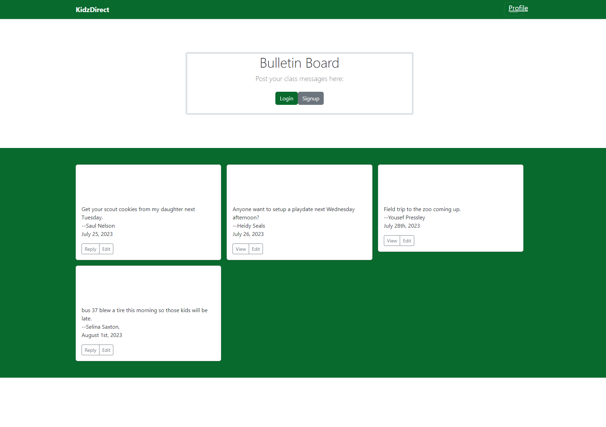
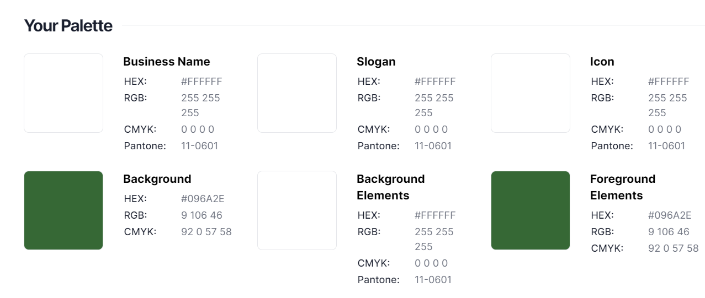
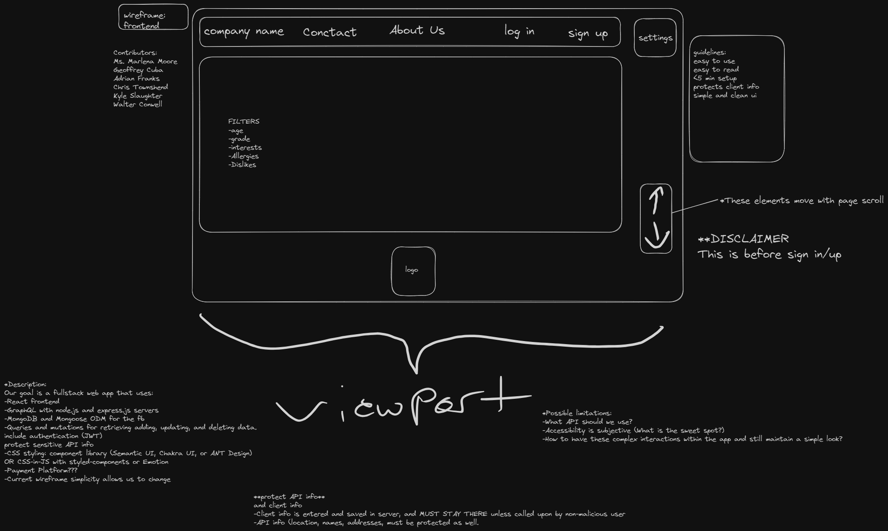
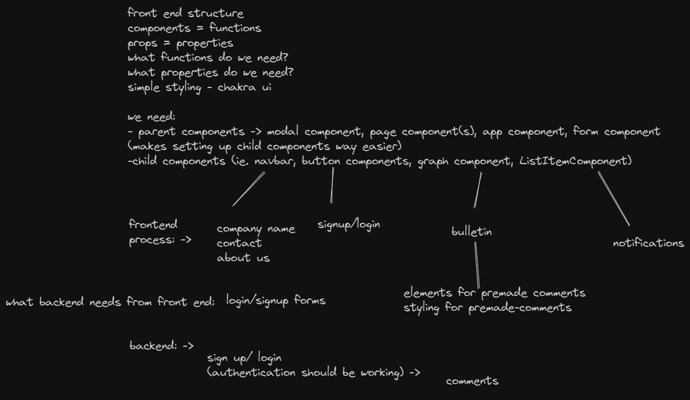

# KidzDirect

## Table of Contents

- [Description](#Description)
- [Usage](#Usage)
- [Installation](#Installation)
- [License](#License)
- [Contributing](#Contributing)
- [Tests](#Tests)
- [Questions](#Questions)
- [Wireframe](#Wireframe)

## Description

A networking resource for parents with children in the same class.

## Usage

Browse to deployed URL and sign up to use. See installation for more information.

## Installation

This app is not intended to be installed, just used from its deployed location. However, if you clone / download the repository, have mongoDB installed, then run npn i && npm run seed && npm run develop, you should be able to browse to localhost:3000 and see the application.

## Questions

Contact github users ACFcoding, ctowns5, Geoffreycuba, KyleSl, Ms-Marlena, or Walter-Conwell with questions.

## Contributing

ACFcoding, ctowns5, Geoffreycuba, KyleSl, Ms-Marlena, Walter-Conwell

## Tests

tested with apollo playground.

## License

Licensed under the [MIT](https://opensource.org/licenses/MIT) license

## ScreenShot

## Wireframe and design elements

### logos and color map generated with : https://app.logo.com/

## link to github repository: https://github.com/Walter-Conwell/parentSchedulingApp

## link to deployed application: https://murmuring-shelf-98145-47fc04f5ec66.herokuapp.com/